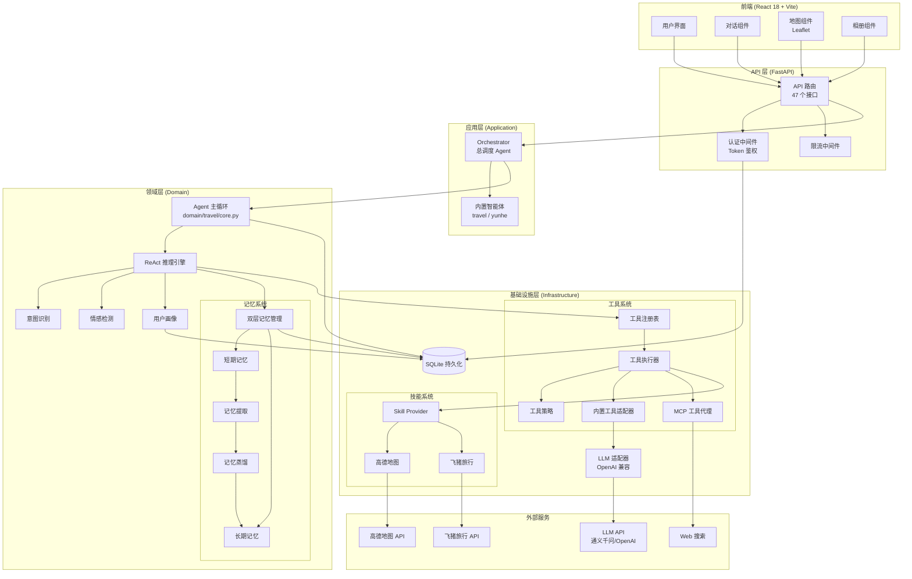

# 云合 — 通用智能体平台

通用 Agent 调度 + 领域 Agent + Skill + MCP · 智能旅行 · 流式对话 · 地图展示 · 花费统计 · 一键分享

[](https://www.python.org/downloads/)
[](https://reactjs.org/)
[](https://fastapi.tiangolo.com/)

---

## 功能亮点

- **多智能体架构** — Orchestrator 总调度 + TravelAgent / DynamicAgent + 自定义 Agent，LLM 智能路由
- **AI 流式对话** — SSE 流式对话，实时展示思考过程与工具调用状态
- **行程生成** — 根据需求自动生成多日行程，含景点、时间、费用、贴士
- **地图展示** — Leaflet + 高德瓦片地图，标记行程地点并绘制路线
- **花费统计** — 按天/按活动统计预算与实际花费，支持打卡记录
- **行程分享** — 生成分享链接，无需登录即可查看行程
- **行程对比** — 最多 4 个行程横向对比预算与活动
- **相册管理** — 上传旅行照片，自动提取 EXIF 地理位置，地图标记，AI 生成游记
- **记忆系统** — 双层记忆（短期/长期），自动提取用户偏好与旅行经验，支持记忆蒸馏
- **Skill + MCP** — 模块化技能（高德地图、飞猪旅行、arXiv 学术搜索）与 MCP 工具代理，可扩展
- **情感检测** — 实时检测用户情绪，自动调整回复策略
- **用户画像** — 根据交互记录自动构建用户偏好标签
- **审计日志** — 记录 LLM 调用、工具执行、意图识别全链路审计事件
- **热门推荐** — 实时抓取旅行热门话题与目的地推荐
- **新闻收藏** — 收藏感兴趣的新闻话题，自动提取到短期记忆
- **用户系统** — 注册/登录、Token 鉴权

---

## 系统架构




---

## 技术栈

| 层 | 技术 |
|----|------|
| 后端 | Python 3.11 · FastAPI · SQLite · OpenAI 兼容 API · 高德地图 Web服务 API · arXiv API |
| 前端 | React 18 · TypeScript · Vite 6 · Tailwind CSS 3 · Zustand · Leaflet · Framer Motion · React Router 7 |
| Agent | ReAct 推理循环 · 双层记忆 · 意图识别 · 情感检测 · MCP 工具代理 · Skill 系统 · 记忆蒸馏 |
| 基础设施 | Uvicorn · Prometheus · Redis（可选） · DDD 分层架构 · 异步任务调度 |

---

## 前端开发指南

> **前端将交给其他开发者独立开发，你是后端维护者。** 以下信息帮助前端团队快速上手。

### 前端技术栈

| 类别 | 技术 |
|------|------|
| 框架 | React 18 |
| 语言 | TypeScript |
| 构建 | Vite 6 |
| 样式 | Tailwind CSS 3 |
| 状态管理 | Zustand |
| 路由 | React Router 7 |
| 地图 | Leaflet |
| 动画 | Framer Motion |

### 前端目录结构

```
frontend/
├── src/
│   ├── pages/               # 页面
│   │   ├── Home.tsx          # 主对话页
│   │   ├── ItineraryOverview.tsx  # 行程详情
│   │   ├── ComparePage.tsx   # 行程对比
│   │   ├── FavoritesPage.tsx # 收藏页面（新闻/话题）
│   │   ├── AlbumPage.tsx     # 相册管理
│   │   └── SharedItinerary.tsx # 分享页（无需登录）
│   ├── components/           # 通用组件
│   │   ├── AppLayout.tsx     # 应用布局组件
│   │   ├── TrendingBar.tsx   # 热门推荐栏
│   │   ├── Chat/             # 对话组件
│   │   ├── Album/            # 相册组件
│   │   └── Itinerary/        # 行程组件
│   ├── hooks/                # Zustand store
│   └── utils/                # 工具函数
├── vite.config.ts            # Vite 配置（含 API 代理）
└── package.json
```

### API 调用方式

Vite 已配置代理，前端直接请求 `/api/*` 即可，无需处理跨域：

```typescript
// 推荐 axios 封装
import axios from 'axios';

const api = axios.create({
  baseURL: '/api',
  headers: { 'Content-Type': 'application/json' },
});

// 自动携带 Token
api.interceptors.request.use(config => {
  const token = localStorage.getItem('claw_token');
  if (token) config.headers.Authorization = `Bearer ${token}`;
  return config;
});

// 全局 401 处理
api.interceptors.response.use(
  res => res,
  err => {
    if (err.response?.status === 401) {
      localStorage.removeItem('claw_token');
      window.location.href = '/login';
    }
    return Promise.reject(err);
  }
);
```

### 核心接口速览

| 接口 | 用途 | 鉴权 |
|------|------|------|
| `POST /api/auth/login` | 登录 | 公开 |
| `POST /api/auth/register` | 注册 | 公开 |
| `GET /api/agents` | 获取智能体列表 | 需登录 |
| `POST /api/sessions` | 创建会话 | 需登录 |
| `GET /api/sessions` | 会话列表 | 需登录 |
| `POST /api/chat/stream` | **流式对话（SSE）** | 需登录 |
| `POST /api/chat` | 同步对话 | 需登录 |
| `GET /api/itineraries` | 行程列表 | 需登录 |
| `GET /api/itineraries/:id` | 行程详情 | 需登录 |
| `POST /api/itineraries/:id/photos` | 上传照片 | 需登录 |
| `POST /api/feedback` | 提交反馈（👍/👎） | 需登录 |
| `GET /api/trending` | 热门推荐 | 公开 |
| `GET /api/shared/:token` | 分享页 | 公开 |
| `GET /api/news/favorites` | 新闻收藏列表 | 需登录 |
| `POST /api/news/favorites` | 收藏新闻 | 需登录 |

> 📘 **完整 API 文档**：[docs/api/API.md](docs/api/API.md) — 50 个接口，含 TypeScript 类型定义、SSE 流式处理代码示例、错误码说明。

---

## 快速开始

### 后端启动（你维护的部分）

```bash
python -m venv .venv
# Windows: .venv\Scripts\activate  |  macOS/Linux: source .venv/bin/activate
pip install -r requirements.txt
cp config/.env.example .env
# 编辑 .env，至少填入 CLAW_API_KEY 和 AMAP_WEBSERVICE_KEY
uvicorn api.server:app --reload --host 0.0.0.0 --port 8000
```

### 前端启动（交给前端团队）

```bash
cd frontend
npm install
npm run dev         # 端口 5173，自动代理 /api → localhost:8000
```

打开 http://localhost:5173 即可使用。

---

## 部署指南

### 方式一：Railway（推荐）

1. Fork 本项目到 GitHub
2. 访问 [Railway](https://railway.app/)，使用 GitHub 登录
3. 点击 "New Project" → "Deploy from GitHub repo"
4. 选择你的仓库，Railway 会自动检测并构建
5. 在 "Variables" 中添加环境变量（`CLAW_API_KEY`、`AMAP_WEBSERVICE_KEY` 等）
6. 等待部署完成，获取访问链接

### 方式二：Render

1. 访问 [Render](https://render.com/)，使用 GitHub 登录
2. 点击 "New" → "Web Service"
3. 连接你的 GitHub 仓库
4. 配置构建命令：
   - **Build Command**: `pip install -r requirements.txt && cd frontend && npm install && npm run build`
   - **Start Command**: `uvicorn api.server:app --host 0.0.0.0 --port $PORT`
5. 添加环境变量，部署

### 方式三：本地部署

```bash
# Windows
.\start.ps1

# Linux / macOS
chmod +x start.sh && ./start.sh
```

---

## 项目结构

```
claw7/
├── api/                    # API 路由与中间件
│   ├── server.py           # FastAPI 主入口（50 个接口，含认证/限流中间件）
│   └── intl_coords.py      # 国际目的地坐标库
├── domain/                 # 领域层（DDD 核心业务逻辑）
│   ├── agent/              # 多智能体系统（Orchestrator / TravelAgent / DynamicAgent）
│   ├── travel/             # 旅行聚合（意图识别 / 行程 / 相册 / 工具 / 推理）
│   ├── memory/             # 双层记忆（提取 / 蒸馏）
│   ├── reasoning/          # ReAct 推理引擎（已迁移到 domain/travel）
│   ├── user/               # 用户聚合（认证 / 画像 / 情感 / 会话）
│   └── shared/             # 共享组件（审计 / 监控 / 运行时）
├── infrastructure/         # 基础设施层
│   ├── tools/              # 工具系统（注册表 / 执行器 / 策略 / 适配器）
│   ├── skills/             # Skill 定义（高德地图 / 飞猪 / 自定义）
│   ├── llm/                # LLM 适配器（OpenAI 兼容客户端）
│   ├── persistence/        # 持久化（SQLite 数据库 / 健康检查 / 会话仓库）
│   ├── mcp/                # MCP 工具代理（运行时 / 目录 / 服务器配置）
│   └── external/           # 外部服务集成
├── application/            # 应用层
│   ├── builtin_agents/     # 内置智能体 YAML 配置（travel / yunhe / academic）
│   ├── scheduler.py        # 调度器（记忆维护后台任务）
│   └── trending/           # 热门推荐管理
├── config/                 # 配置层
│   ├── settings.py          # Pydantic Settings 集中管理
│   └── .env.example         # 环境变量模板
├── frontend/               # React 前端
│   ├── src/pages/          # 页面（Home / ItineraryOverview / Favorites / Album / Shared）
│   ├── src/components/     # 通用组件（AppLayout / TrendingBar / Chat / Album / Itinerary）
│   ├── src/hooks/          # Zustand 状态管理
│   └── src/utils/          # 工具函数
├── tests/                  # 测试（16 个测试文件）
├── docs/                   # 文档
│   ├── README.md           # 详细项目说明
│   ├── api/API.md          # API 接口文档（50 个接口）
│   ├── architecture.md     # DDD 架构说明
│   ├── PROJECT_MODULE_OVERVIEW.md  # 项目模块概览
│   ├── MULTI_AGENT_DEV.md  # 多智能体开发指南
│   └── UNIVERSAL_AGENT_DESIGN.md  # 通用 Agent 设计文档
├── app.py                  # Agent 构建（依赖注入容器）
├── start.ps1 / start.sh    # 启动脚本（Windows / Linux）
└── requirements.txt        # Python 依赖
```

---

## 环境变量

| 变量 | 必填 | 默认值 | 说明 |
|------|------|--------|------|
| `CLAW_API_KEY` | ✅ | — | LLM API 密钥 |
| `CLAW_MODEL` | ❌ | `qwen3.5-122b-a10b` | 模型名称 |
| `CLAW_BASE_URL` | ❌ | 通义千问 DashScope | OpenAI 兼容 API 地址 |
| `AMAP_WEBSERVICE_KEY` | ✅ | — | 高德地图 Web服务 Key |
| `AMAP_JS_API_KEY` | ❌ | — | 高德地图 JS API Key（前端） |
| `FLYAI_API_KEY` | ❌ | — | 飞猪旅行 API Key |
| `CLAW_LOG_LEVEL` | ❌ | `DEBUG` | 日志级别 |
| `CLAW_DATABASE_PATH` | ❌ | `data/claw.db` | SQLite 数据库路径 |
| `CLAW_RATE_LIMIT_RPM` | ❌ | `60` | 每分钟请求限制 |
| `CLAW_METRICS_ENABLED` | ❌ | `true` | 是否启用 Prometheus 监控 |
| `CLAW_METRICS_PORT` | ❌ | `9090` | Prometheus 指标端口 |
| `CLAW_REDIS_URL` | ❌ | `redis://localhost:6379/0` | Redis 连接地址 |
| `CLAW_EMOTION_ENABLED` | ❌ | `true` | 是否启用情感检测 |
| `CLAW_AUDIT_ENABLED` | ❌ | `true` | 是否启用审计日志 |
| `CLAW_MAX_ITERATIONS` | ❌ | `15` | Agent 最大推理轮次 |
| `CLAW_MEMORY_DISTILL_THRESHOLD` | ❌ | `2` | 记忆蒸馏阈值 |

完整配置项参见 [config/.env.example](config/.env.example)。

---

## 文档

- [项目详细说明](docs/README.md)
- [API 接口文档](docs/api/API.md) — 50 个接口完整文档
- [DDD 架构说明](docs/architecture.md)
- [项目模块概览](docs/PROJECT_MODULE_OVERVIEW.md)
- [多智能体开发指南](docs/MULTI_AGENT_DEV.md)
- [通用 Agent 设计文档](docs/UNIVERSAL_AGENT_DESIGN.md)

---

## 测试

```bash
pytest tests/ -v
```

---

## 贡献指南

欢迎提交 Issue 和 Pull Request！

1. Fork 本项目
2. 创建特性分支 (`git checkout -b feature/AmazingFeature`)
3. 提交更改 (`git commit -m 'Add some AmazingFeature'`)
4. 推送到分支 (`git push origin feature/AmazingFeature`)
5. 开启 Pull Request

---

## 许可证

Private © 2026 云合 Contributors
